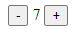

# Counter Widget:


This counter "widget" has two buttons on either side of a number.  Clicking the button with a plus sign on it increments the number and clicking the button with a minus sign on it decrements it.  It can go negative.  The initial value is 10.

While this doesn't make much sense (you should use an input type range instead), it does demonstrate a minimal use of js-min.  It has reactivity and event listeners.  Let's look at each line inside the module script tag.

# Imports:
```javascript
import html from 'templating/html.mjs';
import mount from 'templating/mount.mjs';
```
These first two imports pull in the base templating functions.  They are bread and butter for making things happen in js-min.  'html' is a template literal tag function.  It returns a TemplateInstance User.  All of the expressions in the template literal are converted to Users and will be paired with the parts that the template-instance creates.  We'll talk more about the conversion from template literal -> template-instance and the types of parts used in a little bit.  TemplateInstance's can be bound to node parts meaning that they can be placed anywhere that an html node could be placed.  They can't be used with attribute or attribute value parts for instance.

The mount function is useful because it binds a user to a node-part that it makes and appends to an html element.  This is how I usually bootstrap my tree of template-instances.  It also returns a callback that you can use to unbind the user but I rarely use that.

```javascript
import LiveData from 'reactivity/live-data.mjs';
```
LiveData is used to build the reactivity in this example.  LiveData objects have a getter and setter called 'value' that is used to set the value of the live-data object.  To use it reactively you can use it's async iterator.  The async iterator on live-data sends updates when its value changes.  If you're curious about the internals you can read the live-data code.  It's pretty short.  That will tell you how it handles an async iterator that stops calling `.next()` or how it determines if the value that has been set is actually different from the existing value and is thus a change.

```javascript
import on from 'users/on.mjs';
```
The on function is used to add event listeners.  The User that it produces can only be bound to attribute parts.  There is also an on_mult user that can be used to add multiple events to the same element.  It will also remove the event listener when it is unbound from the part.

# Setting up Reactivity:
```javascript
const count = new LiveData();
count.value = 10;
```
The first line creates a live-data object and the second sets the initial value for that live-data object.  This is roughly identical to doing:
```javascript
const count = new LiveData(10);
```
The nice thing about the second way is that the live-data object doesn't have to try and update anyone who is listening.

# Templating:
```javascript
mount(html`
	<button ${on('click', () => count.value -= 1)}>-</button>
	${count}
	<button ${on('click', () => count.value += 1)}>+</button>
`, document.body);
```
Here we are mounting a template instance to the body.

html is making a template instance that has three parts (in order): an attribute-part, a node-part, and an attribute-part.  The two attribute parts are used to add event listeners to the button elements.  These event listeners increment and decrement the value of count.  

The node-part is used to reactively show the value of count.  The conversion from these expressions to users is done by expression2user in users/common.mjs.  I intend to make this adjustable in the future but let's look at the current version:
```javascript
export function expression2user(expression) {
    if (!(expression instanceof User)) {
		if (expression ) {
			if (expression instanceof Reactive) {
				return reactiveUser(expression);
			} else if (expression[Symbol.asyncIterator]) {
				// Sink any streams
				// Default Sink simply replaces the value with each item.  Alternate uses of the items (like appending) would need to be specified manually.  Replace is just the default.
				return sinkReplace(expression);
			} else if (expression.then) {
				// Use replacement for any promises
				return awaitReplace(expression);
			} else if (expression instanceof Array) {
				return arrayHandle(expression);
			}
		}
		return constant(expression);
    } else {
        return User.get(expression);
    }
}
```
If the expression is already a User then that is returned.  If it isn't then it goes through and checks to find out what kind of user it should be.  Live-data objects aren't User's and their not Reactive, but they do implement async-iterator.  So we could have also written (assuming we'd imported sinkReplace):
```javascript:
mount(html`
	<button ${on('click', () => count.value -= 1)}>-</button>
	${sinkReplace(count)}
	<button ${on('click', () => count.value += 1)}>+</button>
`, document.body);
```
What does sinkReplace do?  It waits to be bound to a part and then asyncronously iterates over the value passed into it.  Whenever it gets a new value it replaces the value in the part.  Alternative ways of handling async-iterables could be to append the values one after another, or you could wait until the iterator completes and then show all the values.  sinkReplace is just the default - and like I said, I want to make it so that you can configure how you want non-User expressions to be converted to users in the future.  The last thing that sinkReplace does is call return when it get's unbound from the part and then clears the part.

# How template literals become template-instances:
This is the only fairly complicated part of js-min.  I think it deserves it's own article.

# Full Code:
```html
<html lang="en">
<head>
	<meta charset="UTF-8">
	<meta name="viewport" content="width=device-width, initial-scale=1.0">
	<title>Counter Widget</title>
	<script type="importmap">
		{	
			"imports": {
				"cancellation": "/src/cancellation/",
				"lib/": "/src/lib/",
				"parts/": "/src/parts/",
				"reactivity/": "/src/reactivity/",
				"users/": "/src/users/",
				"templating/": "/src/templating/",
				"custom-elements/": "/src/custom-elements/"
			}
		}
	</script>
</head>
<body>
	<script type="module">
		import html from 'templating/html.mjs';
		import mount from 'templating/mount.mjs';
		import LiveData from 'reactivity/live-data.mjs';
		import on from 'users/on.mjs';

		const count = new LiveData();
		count.value = 10;

		mount(html`
			<button ${on('click', () => count.value -= 1)}>-</button>
			${count}
			<button ${on('click', () => count.value += 1)}>+</button>
		`, document.body);
	</script>
</body>
</html>
```